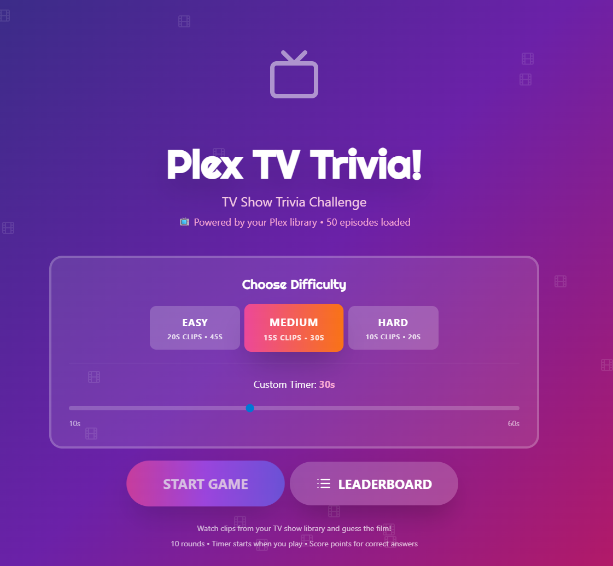
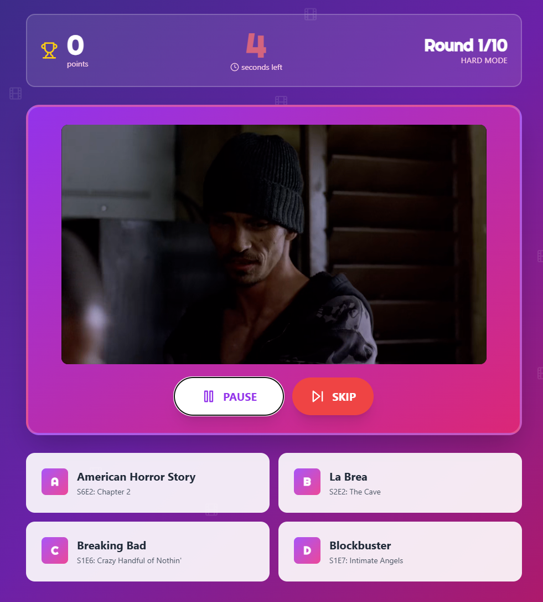
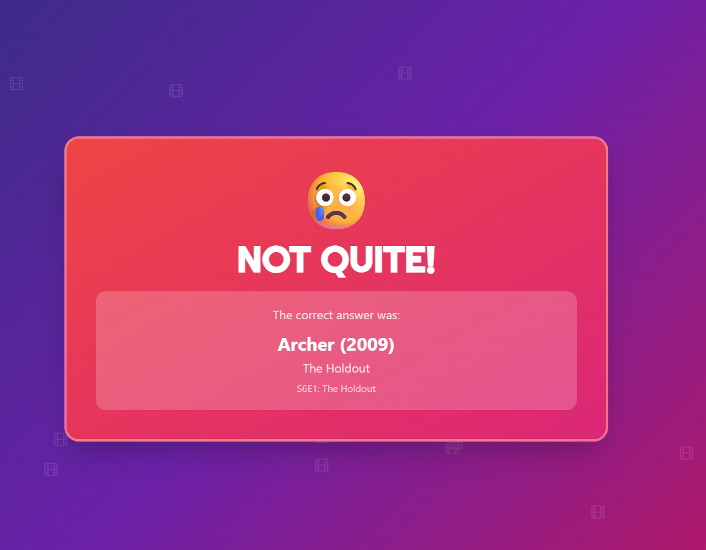

# Plex Tv Trivia Game

A web-based TV show trivia game using your Plex TV library. Watch episode clips and guess the show!



## Features

- Three difficulty levels with configurable clip lengths and timers
- Cross-device leaderboard with time-based rankings
- Real-time video streaming from your Plex server
- Mobile-friendly responsive design
- 10 rounds per game





## Quick Start

### Prerequisites

- Docker and Docker Compose
- Plex Media Server with a movie library
- Plex authentication token

### Get Your Plex Token

If you have Plex Desktop you can find it in 'C:\Users\[USER]\AppData\Local\Plex\Plex Media Server\Preferences.xml'.
OR
1. Go to https://app.plex.tv and play any media
2. Click the menu (⋯) → "Get Info" → "View XML"
3. Copy the token from the URL: `X-Plex-Token=YOUR_TOKEN`

More details: https://support.plex.tv/articles/204059436

### Installation

```bash
git clone https://github.com/yourusername/scene-that-plex.git
cd scene-that-plex
```

Edit `docker-compose.yml`:

```yaml
environment:
  - PLEX_URL=http://192.168.1.100:32400
  - PLEX_TOKEN=your_actual_token_here
```

Run:

```bash
docker-compose up -d
```

Access at: `http://localhost:3002`

## Troubleshooting

**No movies loading:**
- Verify Plex is running and accessible
- Check `PLEX_URL` and `PLEX_TOKEN` are correct
- Ensure you have a movie library in Plex

**Video not playing:**
- Check browser console for errors
- View Docker logs: `docker-compose logs`
- Try a different browser (Chrome/Firefox recommended)

**Port conflict:**
```yaml
ports:
  - "8080:3001"  # Use port 8080 instead
```
## Companion Apps

Check out the movie version: [Plex-Music-Trivia-Game](https://github.com/whosliam/Plex-Music-Trivia-Game)
Check out the music version: [Plex-Music-Trivia-Game](https://github.com/whosliam/Plex-Music-Trivia-Game)

## License

MIT License
